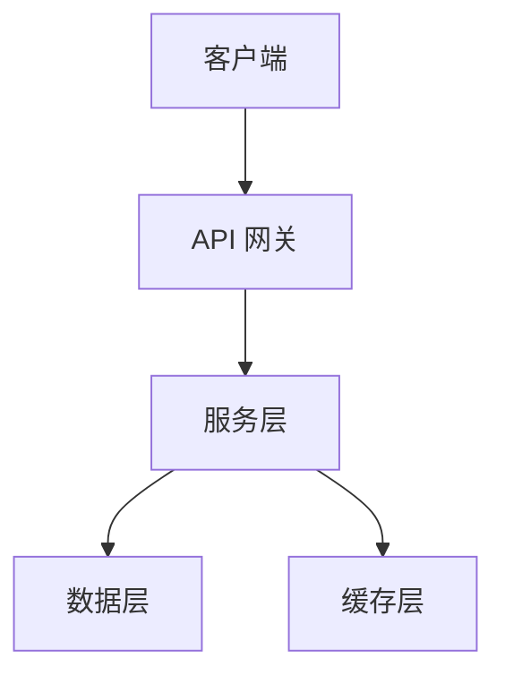
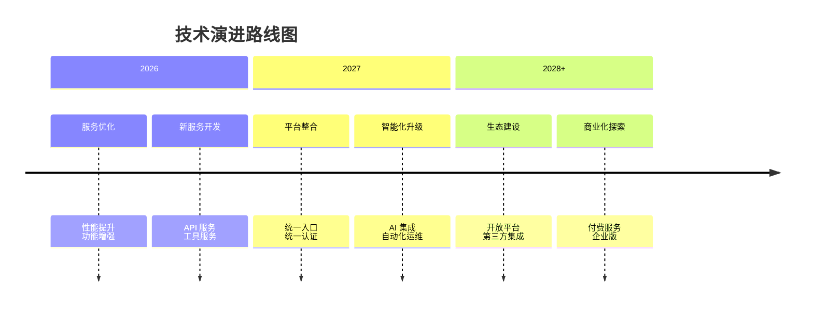

## 引言

::alert{type="info"}
#title
关于本文
本文旨在系统性地展示我维护的公开服务与开源项目，方便社区了解和使用。
::

作为一名热衷于开源和技术分享的开发者，我一直致力于构建和维护一些实用的公开服务与开源项目。这些项目涵盖了从基础设施服务到开发工具的多个领域，旨在解决实际问题和提升开发效率。

本文将按照服务类别、项目时间线等维度，详细介绍这些服务与项目的核心功能、技术实现和使用方式。

## 公开服务

::alert{type="question"}
#title
什么是公开服务？
公开服务是指面向公众开放的、可免费使用的在线服务，通常包括 API 服务、代理服务、工具服务等。
::

### 基础设施服务

::folding
#title
公益前端镜像库
#default

::alert{type="info"}
#title
融合Jsdelivr Unpkg等前端资源库
为中国大陆提供合法可控高速稳定的前端资源镜像服务
::

::quote
**技术栈**：[Go]{.text-story}、[Vue]{.text-story}、[Nginx]{.text-story}、[Docker]{.text-story}、[HTML]{.text-story}
::

**访问方式**：

:copy{prompt="青序栈公共镜像源(在建)" code="https://mirror.qixz.cn/"}

**使用场景**：

::card-list
- 场景1：解决GFW对前端资源的访问限制
- 场景2：解决国内访问前端资源缓慢问题
- 场景3：需要合法可控的前端资源镜像
::

**服务状态**：

:badge[Coding DEV]{square}

**注意事项**：

::alert{type="warning"}
使用本服务时请注意相关限制和条款
::
::

### 功能API服务

::folding
#title
雾都API
#default

::alert{type="info"}
#title
致力于为用户提供稳定、快速的免费API数据接口服务。
::

::quote
**技术栈**：[PHP]{.text-story}、[MySQL]{.text-story}、[JSON]{.text-story}
::

**访问方式**：

:copy{prompt="API 端点" code="https://api.wudu.ltd/"}

**使用示例**：

```js
const example = await fetch('https://api.wudu.ltd/api/acg?return=json')
const data = await example.json()
console.log(data.data.image_url)
```

**服务状态**：

:badge[运行中]{square}
::

### 内容分发服务

::folding
#title
CF优选
#default

::alert{type="info"}
#title
提高Cloudflare CDN在中国大陆的访问速度
::

::quote
**技术栈**：[DNS]{.text-story}、[Python]{.text-story}、[Curl]{.text-story}
::

**访问方式**：

:copy{prompt="服务地址" code="https://cdn.xnet.ren/"}

**性能指标**：

| 指标 | 数值 |
| --- | --- |
| 延迟 |  |
| 可用性 |  |
| 节点数量 | 20 个 |

**服务状态**：

:badge[运行中]{square}

::alert{type="warning"}
#title
使用限制
请注意服务的使用限制和配额
::
::

## 项目展示

::alert{type="question"}
#title
项目分类
项目按照开发时间和类别进行组织，涵盖前端、后端、工具等多个领域。
::

### 前端项目

::folding{close}
#title
domain-card
#default

::alert{type="info"}
#title
嫖了太多免费二级域名没地方用，放个单页吧
::

**核心功能**：

::card-list
- 功能1：作者联系功能，包括邮箱、微信、QQ等
- 功能2：服务信息，包括CDN、托管平台等
- 功能3：NAV功能，导向其他站点
::

**技术亮点**：
- **亮点1**：纯静态部署，无需后端支持，可托管在任意静态空间或CDN上
- **亮点2**：响应式设计，完美适配桌面端和移动端，提供一致的用户体验
- **亮点3**：轻量级实现，代码精简，加载速度快

::quote
**技术栈**：[HTML]{.text-story}、[JavaScript]{.text-story}、[CSS]{.text-story}
::

**成果展示**：

::pic
---
src: https://pic.wudu.ltd/pic/2026/02/10/698ae7d3877ab.webp
caption: 项目截图
---
::

**项目地址**：

::link-card
---
icon: https://github.com/favicon.ico
title: 域名信息展示页
link: https://github.com/scfcn/domain-card
---
::

**项目状态**：
:badge[停止维护]{square}
::

### 后端项目

::folding
#title
雾ICP备案中心
#default

::alert{type="info"}
#title
一个暑假，偶发想法想复刻萌备
::

**核心功能**：

::card-list
- 功能1：查询/增改ICP备案信息
- 功能2：巡查BOT自动审核
- 功能3：定时通知
::

**技术亮点**：

::quote
**技术栈**：[PHP]{.text-story}、[MySQL]{.text-story}、[HTML]{.text-story}
::

- **亮点1**：基于PHP的后端服务，支持查询、增改ICP备案信息
- **亮点2**：使用MySQL数据库存储备案信息，支持增删改查操作
- **亮点3**：定时任务巡查BOT，自动审核备案信息

**架构设计**：



**项目地址**：

::link-card
---
icon: https://github.com/favicon.ico
title: WUICP
link: https://github.com/scfcn/wuicp
---
::

**项目状态**：

:badge[维护中]{square}
::

### 工具项目

::folding
#title
雨云自动签到
#default

::alert{type="info"}
#title
雨云签到有积分，能提现到账户余额或支付宝
::

**核心功能**：

::card-list
- 功能1：定时自动登录与签到
- 功能2：图像识别验证码
- 功能3：多账户支持
- 功能4：签到结果通知
::

**技术亮点**：
- **亮点1**：基于Python的脚本，使用Selenium模拟浏览器操作，自动登录雨云账号
- **亮点2**：使用ddddocr库对验证码进行识别，无需手动输入
- **亮点3**：支持多账户同时签到，方便管理多个账号
- **亮点4**：签到结果通知，使用notify.py，支持大部分主流平台
- **亮点5**：GitHub Actions 自动运行，无需手动触发，完全免费
- **亮点6**：所有信息均加密保存在Repository secrets

::quote
**技术栈**：[Python]{.text-story}、[Selenium]{.text-story}、[ddddocr]{.text-story}、[Chrome]{.text-story}
::

**使用示例**：

```bash
# 安装
pip install -r requirements.txt

# 使用
python rainyun.py --config config.json
```

**项目地址**：

::link-card
---
icon: https://github.com/favicon.ico
title: 雨云自动签到
link: https://github.com/scfcn/Rainyun-Qiandao
---
::
**项目状态**：

:badge[开发调用AI识别通过验证码]{square}
::

## 技术总结与经验分享

::alert{type="question"}
#title
技术心得
在开发和维护这些服务与项目的过程中，我积累了一些经验和心得。
::

### 技术选型经验

::folding{open}
#title
技术选型的考量因素
#default

在选择技术栈时，我通常会考虑以下几个方面：

::card-list
- **项目需求**：根据项目的具体需求选择合适的技术
- **社区活跃度**：选择社区活跃、文档完善的技术
- **性能要求**：根据性能要求选择合适的技术方案
- **可扩展性**：考虑未来可能的功能需求
- **维护成本**：评估维护难度，考虑长期成本
::

**案例分享**：

::chat
{.}

在选择 [static-mirrors]{.text-story} 的技术栈时，我对比了多个方案，最终选择了 [Go]{.text-story}，原因是：

- **性能**：Go 是一种编译型语言，运行效率高，适合处理高并发请求。
- **可扩展性**：Go 支持并发编程，非常适合构建高可扩展性的服务。
- **维护成本**：Go 代码简洁，易于维护和升级。

{.}

这个选择在实际应用中证明是正确的，项目运行稳定，性能表现良好。
::
::

### 性能优化经验

::folding
#title
性能优化实践
#default

**优化方向**：

::card-list
- **前端优化**：代码分割、懒加载、缓存策略
- **后端优化**：数据库优化、缓存设计、异步处理
- **网络优化**：CDN 加速、压缩传输、连接复用
::

**优化案例**：

```js
// 优化前
function fetchData() {
  return fetch('/api/data').then(res => res.json())
}

// 优化后
async function fetchData() {
  const cached = await cache.get('data')
  if (cached) return cached
  const data = await fetch('/api/data').then(res => res.json())
  await cache.set('data', data, 3600)
  return data
}
```

**优化效果**：

| 指标 | 优化前 | 优化后 | 提升 |
| --- | --- | --- | --- |
| 响应时间 | 500ms | 100ms | 80% |
| 吞吐量 | 100 req/s | 500 req/s | 400% |
::

## 未来规划

::alert{type="info"}
#title
持续改进
技术和需求在不断变化，我也会持续改进这些服务与项目。
::

### 短期计划

::card-list
- **服务优化**：优化现有服务的性能和稳定性
- **功能增强**：根据用户反馈增加新功能
- **文档完善**：完善使用文档和 API 文档
- **问题修复**：修复已知问题和 bug
::

### 中期计划

::card-list
- **新服务开发**：开发新的公开服务
- **技术升级**：升级现有项目的技术栈
- **维护运营**：持续监控服务运行状态，及时修复问题
- **开源贡献**：向开源社区贡献代码
::

### 长期愿景

::folding
#title
长期发展目标
#default
**愿景**：构建一个完整的技术生态，为开发者社区提供更多价值。

**发展方向**：

::card-list
- **平台化**：将分散的服务整合为统一平台
- **智能化**：引入 AI 技术提升服务质量
- **国际化**：支持多语言，服务全球用户
- **商业化**：探索可持续的商业模式
::

**技术演进**：

::
### 联系我

::link-card
---
icon: https://me.qixz.cn/avatar.avif
title: 筱序二十（栈主）
link: https://me.qixz.cn/
description: 个人主页，展示我的技术项目和个人信息
---
::

### 社交媒体

::link-card
---
icon: https://github.com/favicon.ico
title: scfcn(筱序二十)
link: https://github.com/scfcn
description: 我的 GitHub 主页，查看所有开源项目
---

::link-card
---
icon: https://bilibili.com/favicon.ico
title: Bilibili
link: https://space.bilibili.com/1894700727
description: 我的 Bilibili 频道，分享技术视频
---

### 联系方式

::card-list
- **邮箱**：qxbk@qq.com
- **Telegram**：@qxuzh
::

::alert{type="question"}
#title
参与贡献
如果你对我的项目感兴趣，欢迎参与贡献！
::

**贡献方式**：

::card-list
- **代码贡献**：提交 Pull Request
- **问题反馈**：提交 Issue
- **功能建议**：在 Discussion 中讨论
- **文档改进**：完善项目文档
::

## 结语

感谢你阅读本文，希望这些公开服务和项目能够对你有所帮助。如果你有任何问题或建议，欢迎随时联系我。

::quote
开源精神的核心在于分享和协作，让我们一起构建更好的技术生态。
#icon
🤝
::
